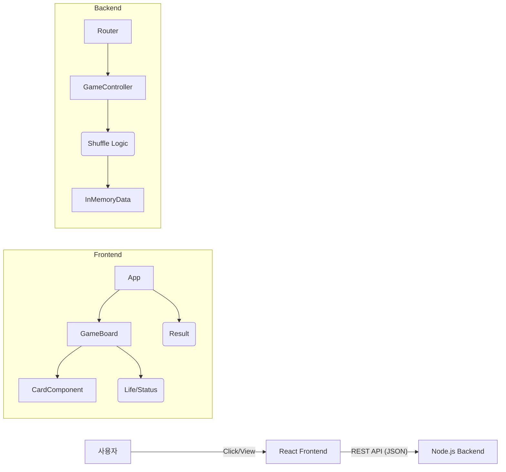

# 카드 짝 맞추기 게임 Tech Spec (TechSpec.md)

## 0. 문서 정보

### 메타 데이터

* **작성일:** 2026-01-20
* **상태:** Draft
* **버전:** v1.0
* **원문 PRD:** [카드 짝 맞추기 게임 PRD v1.0]
* **작성자:** Gemini (AI Assistant)

## 1. 시스템 아키텍처 (System Architecture)

### 1.1 아키텍처 개요

본 프로젝트는 **Client-Server 구조**를 따릅니다. 게임의 핵심 데이터(카드 배치)는 서버에서 생성하여 보안성을 높이고, 사용자의 인터랙션과 상태 관리는 클라이언트(React)에서 처리하여 빠른 응답성을 보장합니다.

### 1.2 시스템 구성도



## 2. 기술 스택 (Tech Stack)

| 구분 | 기술명 | 선정 이유 |
| --- | --- | --- |
| **Frontend** | React (Vite) | 빠른 빌드 속도 및 컴포넌트 기반 UI 개발 용이 |
| **Language** | TypeScript (권장) | 타입 안정성을 통한 런타임 에러 방지 |
| **Styling** | Styled-components | CSS-in-JS를 통한 컴포넌트별 스타일 캡슐화 및 애니메이션 구현 용이 |
| **State Mgt** | Context API + useReducer | 전역 상태(Life, GameStatus) 관리의 복잡도가 낮으므로 사용 |
| **Backend** | Node.js + Express | 가볍고 빠른 설정, JS 풀스택 개발 경험 제공 |
| **Communication** | Axios | 간결한 HTTP 요청 처리 및 인터셉터 기능 활용 |

## 3. 데이터 모델 (Data Model)

### 3.1 Card Object (Frontend & Backend 공통)

각 카드는 고유한 ID와 짝을 맞추기 위한 이미지 키(type)를 가집니다.

```typescript
interface Card {
  id: number;       // 0 ~ 15 (유니크 식별자)
  type: string;     // 예: "apple", "banana" (매칭 비교군)
  imgUrl: string;   // 프론트엔드 표시용 이미지 경로
  isFlipped: boolean; // (Frontend Only) 현재 뒤집힘 상태
  isSolved: boolean;  // (Frontend Only) 매칭 성공 여부
}

```

### 3.2 Game State (Frontend)

```typescript
interface GameState {
  cards: Card[];
  flippedCards: Card[]; // 현재 선택된 카드 (최대 2개)
  life: number;         // 초기값 3
  status: 'IDLE' | 'PLAYING' | 'GAME_OVER' | 'VICTORY';
}

```

## 4. API 명세 (API Specification)

### 4.1 게임 시작 (데이터 요청)

* **Endpoint:** `GET /api/game/start`
* **Description:** 서버에서 16장의 카드를 생성하고 무작위로 섞은(Shuffle) 데이터를 반환합니다.
* **Response (200 OK):**

```json
{
  "gameId": "uuid-v4",
  "cards": [
    { "id": 1, "type": "apple", "imgUrl": "/assets/apple.png" },
    { "id": 2, "type": "banana", "imgUrl": "/assets/banana.png" },
    ... // 총 16개 항목
  ]
}

```

### 4.2 결과 검증 (선택 구현)

PRD의 'API 응답 시간 200ms' 요건을 충족하기 위해, 매칭 로직은 클라이언트에서 우선 처리(Optimistic Update)하고 서버 통신은 게임 시작/종료 시에만 수행하는 것을 권장합니다.

## 5. 상세 기능 명세 (Frontend)

### 5.1 컴포넌트 구조

* **App:** 전체 레이아웃 및 모달 관리.
* **Header:** 남은 기회(Life) 표시.
* **GameBoard:** 4x4 그리드 레이아웃 (display: grid).
* **Card:**
* **Props:** cardData, onClick
* **Style:** transform: rotateY(180deg)를 활용한 3D Flip 애니메이션 구현.


* **ResultModal:** 게임 오버/승리 시 팝업. '재시작' 버튼 포함.

### 5.2 핵심 로직 (Hook: useGameLogic)

* **초기화 (Initialize):** /api/game/start 호출 → 응답받은 카드 데이터를 State에 저장. life = 3, status = PLAYING 설정.
* **카드 클릭 (HandleClick):** 이미 Solved거나, Flipped 상태이거나, flippedCards.length >= 2이면 클릭 무시. 해당 카드를 isFlipped = true로 변경 후 flippedCards 배열에 추가.
* **매칭 판별 (Match Check - useEffect):** flippedCards의 길이가 2가 되면 로직 실행.
* **Case A (일치):** 두 카드의 isSolved를 true로 변경. flippedCards 초기화. 모든 카드가 Solved이면 status = VICTORY.
* **Case B (불일치):** setTimeout (1000ms) 설정. 1초 후 두 카드의 isFlipped를 false로 변경. life 1 차감. life === 0이 되면 status = GAME_OVER.


### 5.3 엣지 케이스 처리

* **광클 방지 (Debounce/Blocking):** 매칭 판별 중(두 카드가 뒤집혀 있는 1초 동안)에는 다른 카드의 클릭 이벤트를 CSS(pointer-events: none) 또는 로직으로 차단.
* **이미지 로딩:** 게임 시작 전 이미지를 미리 로딩(Preload)하여 카드를 뒤집을 때 깜빡임 방지.

## 6. 상세 기능 명세 (Backend)

### 6.1 셔플 로직 (Shuffle Logic)

* **알고리즘:** Fisher-Yates Shuffle 알고리즘 사용.
* **데이터 생성:** 8개의 과일 타입 배열 정의 → 각 타입당 2개의 객체 생성 → 16개 배열 셔플.

### 6.2 에러 핸들링

* 서버 내부 오류 시 500 에러 반환.
* 프론트엔드에서는 try-catch로 감싸고 에러 발생 시 "서버 연결에 실패했습니다" alert 노출.

## 7. UI/UX 스타일 가이드

* **Grid System:** Container width 600px, height 600px. grid-template-columns: repeat(4, 1fr). Gap 10px 이상.
* **Animation:** Flip Duration 0.4s ~ 0.6s. preserve-3d, backface-visibility: hidden 효과.
* **Colors:** Background: #f0f2f5, Card Back: #2c3e50, Success: Green point, Fail: Red/Orange point.

## 8. 개발 마일스톤 (Development Milestones)

* **Phase 1 (Setup):** React 및 Express 프로젝트 생성, 연동 설정 (CORS 등).
* **Phase 2 (Backend):** 카드 데이터 생성 및 /start API 구현.
* **Phase 3 (UI Skeleton):** 4x4 그리드 및 카드 컴포넌트 기본 스타일링.
* **Phase 4 (Game Logic):** 카드 뒤집기, 매칭 판별, Life 차감 로직 구현.
* **Phase 5 (Polish):** 애니메이션 적용, 모달 구현, 리팩토링 및 버그 수정.